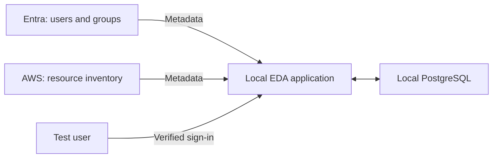

# Enterprise Data Access (EDA)

**A foundation for giving AI agents controlled access to company data, on behalf of the people who task them.**

An agent might need to find a document, inspect a cloud resource, or answer a question using a database. Before it receives anything, a system needs to answer:

- Which agent is asking, and who authorized its task?
- What is that person currently allowed to access?
- What part of that access was delegated to this task?
- What information can be returned, and what evidence should be recorded?

EDA is being built to answer those questions across different systems, while keeping the control plane in the organization's own environment.

> **Current status: a working inventory and identity sandbox, not a finished agent authorization product.** Live Entra/AWS collection and local recovery have been tested. Carrying both the agent and user identities, task delegation, and comprehensive native data permissions still need implementation. Production startup is deliberately blocked.

## What it does today

EDA collects information about users, groups and resources and builds a relationship graph: a connected map of those records. It records where the information came from, replaces old information after a complete synchronization, and rejects stale evidence in supported access paths.

The current sandbox connects:

| Component | Its job |
| --- | --- |
| Microsoft Entra ID | Supplies users, groups and verified human sign-in identities |
| AWS | Supplies metadata about buckets, IAM roles and EC2 instances |
| EDA, running locally | Imports relationships, applies supported checks and records audit evidence |
| Local PostgreSQL | Stores the graph, synchronization state and audit records |

The connectors collect **metadata**: information describing resources. The sandbox does not download S3 documents, copy database rows or give an agent general access to your cloud account.

## The intended agent model

Every agent request must carry **both the agent's identity and the identity of the person who authorized its work**, backed by a valid delegation. There is no planned agent-only authority path for autonomous agents.

An agent's access must stay within the user's current permissions, the delegated task scope and any additional restrictions. An agent ID provides accountability; it does not grant access by itself.

**That model is a design requirement, not a capability already delivered by this repository.** The directory collector is an operator-run infrastructure tool, not an autonomous data-access agent.

## Why the graph and connector SDK matter

The graph helps explain how identities and resources relate. The connector SDK gives different systems a common way to send objects and relationships to EDA.

Different providers still have different permission rules. A line connecting a user to a resource is not proof of native access. AWS and PostgreSQL effective-permission evaluation remains incomplete; inventory records do not automatically become grants.

## Start here

1. **[Install the sandbox](INSTALL.md)** — prerequisites, setup order and exact commands.
2. **[Use and test EDA](docs/USAGE.md)** — start services, import real metadata, check sign-in and interpret results.
3. **[See current capabilities and limits](docs/IMPLEMENTATION_STATUS.md)** — what is implemented, tested and still outstanding.
4. **[Review the design roadmap](PRODUCTION_ROADMAP.md)** — the larger production plan.

The connected setup order is **Entra and AWS → generate local settings → start Docker → import and test**. Entra and AWS can be configured in either order. Install Docker Desktop at any time.

## What has been tested

A sandbox run passed 21 live/local checks, covering real Entra/AWS imports, stored-record matching, authentication refusals, repeated imports, controlled import interruption, restricted AWS reads, audit hash verification and local container restart recovery.

This does **not** prove agent delegation, provider-side membership revocation, complete native permission evaluation or production readiness. Interactive human sign-in was not completed in that run. See the [sanitized test summary](docs/LIVE_TEST_SUMMARY.md).

## Small sandbox, larger production work

The initial setup runs EDA and PostgreSQL on your computer. AWS contains one small EC2 inspection target and a private S3 bucket. The instance defaults to stopped; its disk still incurs storage charges. There is no AWS API Gateway, NAT gateway, load balancer or hosted database in the small sandbox module.

The separate `infra/` directory is a broader infrastructure foundation. It is **not** the small sandbox and does not yet deploy a complete production application. Kubernetes packaging is not implemented.

## Repository guide

| Location | Contents |
| --- | --- |
| `sandbox/` | Connected sandbox setup and operator test tools |
| `deploy/` | Dockerfile and a separate local-only demo composition |
| `beta/` | Python application, migrations and tests |
| `contracts/v1/` | Versioned connector JSON schemas |
| `docs/` | Usage, connectors, migrations, limitations and security design |
| `infra/` | Incomplete broader deployment foundation; not the first-install path |

## Keep private configuration private

Use a disposable test tenant/account and synthetic data. Never commit `.env`, real `.tfvars`, Terraform state/plans, credentials, database files or raw diagnostics. The repository includes templates, not real account settings. Terraform can store generated secrets in its state even when outputs are marked sensitive.

The evidence tools produce a separate public report with predefined outcomes. Only share that report after reviewing it; do not publish the raw diagnostic folder. Nothing is uploaded automatically.
